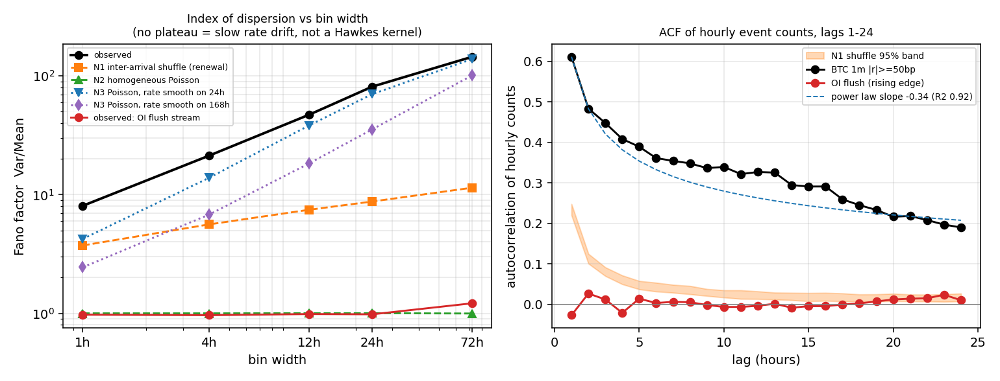

# S-Hawkes note — is there self-excitation in p300's event streams?

STATUS: CONCLUDED PARK per pre-registration — no stream is flagged as worth a Hawkes model. `cd_liquidations` and funding extremes fail the data gate (0.29 y / 125 events, and 114 events in 6.5 y); OI flushes pass the gate and are near-Poisson (n_hat 0.09); the BTC 1-minute stream is hugely over-dispersed (Fano 8.05 at 1 h) but its dispersion never plateaus, so the excess is a slowly varying rate — volatility clustering — not a self-exciting kernel. Descriptive only; no trading claim.

**Status: PRE-REGISTRATION WRITTEN 2026-09-08 BEFORE ANY OUTCOME NUMBER WAS COMPUTED.**
Sections 1–4 below were written and saved first; sections 5+ were appended after
running `hawkes_note_results/hawkes_note.py`.

Descriptive only. No strategy, no backtest, no trading verdict. The question is
narrow: do the event streams p300 already records cluster in time *beyond* what a
Poisson process would produce, strongly enough that a Hawkes model would be
adding something a simpler rate model does not already give?

---

## 1. Candidate streams and their frozen event definitions

Timestamps in `cd_*` tables are epoch **seconds**, hourly cadence; `btc_1m.open_time`
is epoch **milliseconds**. All analysis reads `prod.db` read-only.

Two kinds of threshold rule, applied consistently:

- **Flow variables** (a quantity measured *per bar*: liquidation notional in an hour,
  a 1-minute return). Every threshold crossing is its own event — consecutive
  crossings are exactly the clustering under test, so they are kept.
- **State / overlapping-window variables** (funding *level*, a 4-hour OI change
  computed on a rolling window). These persist mechanically above a threshold for
  many consecutive bars, which would manufacture clustering that is an artefact of
  the definition, not of the process. For these, an event is the **rising edge** —
  the first bar of a new excursion across the threshold.

| id | stream | source | event definition (frozen) |
|----|--------|--------|---------------------------|
| S1 | `LIQ` | `cd_liquidations` | hour where `long_quote_quantity + short_quote_quantity` ≥ full-sample 95th percentile. Flow → every crossing. |
| S2 | `OI_FLUSH` | `cd_open_interest` | `oi_chg_4h = oi_close / oi_close.shift(4) − 1 ≤ −0.02` (the −2%-in-4h rule from `studies/notebooks/oi_flush/research.py`, `FLUSH_THRESHOLDS[0]`). Overlapping window → **rising edge**. Secondary, reference only: the same rule with the study's 24 h cooldown. |
| S3 | `FUND_EXT` | `cd_funding_rate`, restricted to `timestamp < 2026-04-13T00:00:00Z` | `abs(fr_close)` ≥ 95th percentile of `abs(fr_close)` over that era. Persistent state → **rising edge**. |
| S4 | `BTC_1M` | `btc_1m` | `abs(log(close / close.shift(1))) ≥ 0.005` (50 bp in one minute). Flow → every crossing. Robustness variant: threshold = 99.9th percentile of `abs(r)`. |

Two data facts that force restrictions and are recorded here, not discovered later:

- `cd_funding_rate` changes cadence at exactly **2026-04-13T00:00:00Z** (1 h predicted
  → 8 h settlement; 57,397 hourly rows before, 448 8-hourly rows after). Binning a
  stream whose sampling rate drops 8× mid-sample would corrupt every count statistic,
  so S3 is confined to the pre-cutover era.
- The 24 h cooldown in the OI-flush study is a **de-clustering device**. It exists to
  stop the backtest double-counting one flush; applying it here would suppress the
  very quantity being measured. The primary S2 estimate therefore uses the raw
  rising-edge stream, and the cooldown version is reported alongside only to show
  how much of the measured clustering that rule was removing.

## 2. The gate (stated before computing)

A stream is worth *any* Hawkes estimate only if it has **both**:

- **G1 — span ≥ 2.0 years** of usable history, and
- **G2 — ≥ 500 events** in that window.

A stream failing either gate gets its counts reported and nothing else. No estimate
is produced for it, and no amount of interesting-looking output changes that.

## 3. Estimators and nulls (stated before computing)

**Observable.** Bin events into counts on a fixed grid of width `w`, over the stream's
usable window. Report the **Fano factor** `F(w) = Var(counts) / Mean(counts)` — the
index of dispersion. `F = 1` is Poisson; `F > 1` is over-dispersion (clustering).
This is the raw observable and it is reported for every stream that passes the gate.

**Branching ratio.** For a stationary linear Hawkes process the asymptotic index of
dispersion is `1 / (1 − n)²`, where `n` is the branching ratio (the expected number of
direct offspring per event; `n` is also the fraction of events attributable to
self-excitation rather than to exogenous immigrants). Inverting,

```
n_hat(w) = 1 − 1 / sqrt(F(w))          for F ≥ 1, clipped to 0 below
```

**The assumptions this estimator makes, explicitly:**

1. The immigrant (exogenous) process is homogeneous Poisson with a *constant* rate.
   If the true immigrant rate drifts — and in crypto it certainly does, with volatility
   regimes lasting weeks — that drift inflates `F` and `n_hat` reads high even with
   zero genuine self-excitation. This is the estimator's dominant weakness.
2. The bin width is long relative to the kernel's decay time. At `w` shorter than the
   kernel timescale, `F` is attenuated and `n_hat` is a *lower* bound.
3. Stationarity (`n < 1`) and linearity of the intensity.

Because of (1) and (2) the same statistic is computed on a ladder of bin widths
**w ∈ {1 h, 4 h, 12 h, 24 h, 72 h}**. The shape discriminates:

- `F(w)` rising then **plateauing** ⇒ consistent with a Hawkes kernel whose timescale
  is where the plateau starts; the plateau value is the one to invert for `n`.
- `F(w)` **growing monotonically** through 72 h without plateau ⇒ the excess dispersion
  is a slowly varying rate (regime/volatility clustering), which is *not* what a Hawkes
  self-excitation term is for, and a time-varying-rate Poisson model would be the
  honest description.

**Nulls.** Two, both with 200 replications, both re-binned exactly like the observed
stream:

- **N1 — inter-arrival shuffle.** Permute the sequence of inter-arrival times and
  rebuild the point process. This is the null the task specified. Note what it is:
  it destroys the *ordering* of intervals but keeps their marginal distribution, so
  it is a **renewal null, not a homogeneous-Poisson null**. A renewal process with
  heavy-tailed intervals is itself over-dispersed (asymptotically `F → CV²(IAT)`), so
  N1 is the conservative comparison — beating it means the clustering is in the
  *sequencing*, not just in the interval distribution.
- **N2 — homogeneous Poisson**, rate matched to the observed count, same window.
  This is the textbook `F = 1` reference and calibrates the finite-sample noise floor.

For each stream and each `w`: observed `F`, the null distributions' mean and 99th
percentile, and the observed value's percentile within each null.

**Autocorrelation.** ACF of the hourly counts at lags 1…24, with a pointwise 95 %
band taken from the N1 shuffle distribution.

**Trial count / deflation.** Not applicable and deliberately so: nothing here is a
performance metric, there is no Sharpe ratio, no strategy and no selection over
variants. Each stream is measured once with a frozen threshold. Deflated-Sharpe /
PBO machinery would be theatre on a descriptive count statistic. What *does* protect
this note is that the thresholds and the gate above were written down first.

## 4. Flag rule (descriptive, not a trading decision)

A stream is flagged **"worth a Hawkes model"** only if all four hold:

- **C1** passes the gate (G1 and G2);
- **C2** observed `F(1h)` exceeds the 99th percentile of **both** nulls;
- **C3** `n_hat` at the plateau ≥ 0.5;
- **C4** `F(w)` plateaus within the 1 h → 72 h ladder rather than growing monotonically.
  Numeric form: `F(72h) / F(24h) < 1.25` — less than 25 % further growth across the
  final tripling of bin width. *(This numeric form was added to the pre-registration
  on the same day, still before the analysis script was run and before any outcome
  number existed; the qualitative clause it makes precise was written first.)*

Anything else → **park**, with the specific missing condition named.

## 5. Priors (written before the numbers)

- I expect `F ≫ 1` on every stream that passes the gate. Volatility clusters; this is
  not in doubt and it is not news. The informative question is C4, not C2.
- I expect C4 to **fail** on at least the BTC 1-minute stream — I expect monotone
  growth of `F` with bin width, i.e. slow regime drift dominating, because crypto
  volatility has multi-day persistence far longer than any plausible fast kernel.
- I expect `cd_liquidations` to fail the gate outright on span (it looked short).
- Overall prior: **park**, ~75 %.

---

## 6. Data inventory and the gate (measured)

All spans are UTC. "Coverage" = rows present / rows expected on the source's native grid.

| stream | source rows | window | span (y) | coverage | events | G1 span ≥ 2y | G2 ≥ 500 ev | gate |
|---|---|---|---|---|---|---|---|---|
| S1 `LIQ` | 2,494 | 2026-02-25 17:00 → 2026-06-10 08:00 | **0.286** | 99.3 % | **125** | ✗ | ✗ | **FAIL** |
| S2 `OI_FLUSH` | 40,379 | 2022-01-30 06:00 → 2026-09-08 17:00 | 4.606 | 100.0 % | 1,056 | ✓ | ✓ | **PASS** |
| S3 `FUND_EXT` | 57,397 | 2019-09-25 08:00 → 2026-04-12 21:00 | 6.548 | 100.0 % | **114** | ✓ | ✗ | **FAIL** |
| S4 `BTC_1M` | 3,515,153 | 2020-01-01 00:00 → 2026-09-08 17:02 | 6.688 | 99.9 % | 9,886 | ✓ | ✓ | **PASS** |
| S4b `BTC_1M` p99.9 | 3,515,153 | same | 6.688 | 99.9 % | 3,516 | ✓ | ✓ | **PASS** |

Thresholds actually used: S1 p95 hourly liquidation notional = **$2,817,788**; S2 −2 % / 4 h;
S3 p95 |funding| = **4.8977e-4**; S4 50 bp; S4b p99.9 |1 m return| = **71.79 bp**.

Three inventory facts worth recording beyond the gate:

- **`cd_liquidations` is a frozen feed, not a short one.** Its last row is 2026-06-10, 90 days
  before today. `coindesk.refresh()` — the only writer of `cd_liquidations` — is gated behind
  `AI_QUANT_ENABLED == "true"` in `data/sources/binance.py:1038`, and CoinDesk's data API now
  needs a paid key. The stream is not accumulating and will not reach the gate by waiting.
  `ca_liquidations` (BTC only, 2,092 rows, 2026-02-25 → 2026-05-24) is shorter still.
- **S3 fails on a structural fact, not on sample size.** 2,872 hourly bars sit above the
  |funding| p95 threshold, but they collapse into only **114 excursions** in 6.5 years.
  Extreme funding is not an event stream; it is a slowly varying state that parks above a
  threshold for a day at a time. No amount of extra history fixes that at this definition.
- The S2 flush condition fires on 2,768 raw hourly bars, which the rising-edge rule collapses
  to 1,056 events, and the OI-flush study's 24 h cooldown collapses further to 676.

## 7. Results for the streams that passed

Fano factor `F(w)`, implied `n_hat = 1 − 1/√F`, and both nulls (200 reps each).
"pct" = the observed `F`'s percentile inside that null distribution.

### S2 `OI_FLUSH` — 1,056 events, 4.61 y

| bin | mean count | F | n_hat | N1 shuffle mean / p99 | pct in N1 | N2 Poisson mean / p99 | pct in N2 |
|---|---|---|---|---|---|---|---|
| 1 h | 0.026 | 0.974 | 0.000 | 0.974 / 0.974 | 90.0 | 1.000 / 1.014 | 0.0 |
| 4 h | 0.105 | 0.964 | 0.000 | 0.967 / 0.983 | 28.0 | 0.998 / 1.028 | 0.0 |
| 12 h | 0.314 | 0.986 | 0.000 | 0.979 / 1.008 | 61.5 | 1.002 / 1.062 | 23.0 |
| 24 h | 0.628 | 0.981 | 0.000 | 0.976 / 1.034 | 56.5 | 0.999 / 1.085 | 26.0 |
| 72 h | 1.886 | **1.215** | **0.093** | 1.076 / 1.173 | 100.0 | 1.007 / 1.154 | 99.5 |

ACF of hourly counts, lags 1–24: every value in [−0.027, +0.027], essentially on top of the
shuffle band; sum over 24 lags = 0.069. There is no memory to speak of.

Secondary (reference only) — the same rule **with the study's 24 h cooldown**, 676 events:
`F` = 0.983 / 0.933 / 0.799 / 0.599 / 0.539 at 1/4/12/24/72 h, i.e. progressively **under**-dispersed,
and its hourly ACF is a flat −0.017 at every lag 1–23 followed by a jump at lag 24. That is the
arithmetic signature of a hard refractory period: the cooldown makes two events within 24 h
impossible. It confirms the pre-registered warning that the cooldown is a de-clustering device
and must not be used for this measurement.

### S4 `BTC_1M` — 9,886 events (|1 m log return| ≥ 50 bp), 6.69 y

| bin | mean count | F | n_hat | N1 shuffle mean / p99 | pct in N1 | N2 Poisson mean / p99 | pct in N2 |
|---|---|---|---|---|---|---|---|
| 1 h | 0.169 | **8.05** | 0.647 | 3.729 / 3.819 | 100.0 | 1.000 / 1.012 | 100.0 |
| 4 h | 0.674 | 21.28 | 0.783 | 5.610 / 5.831 | 100.0 | 1.000 / 1.027 | 100.0 |
| 12 h | 2.024 | 47.11 | 0.854 | 7.454 / 7.873 | 100.0 | 1.001 / 1.047 | 100.0 |
| 24 h | 4.048 | 81.22 | 0.889 | 8.748 / 9.289 | 100.0 | 1.002 / 1.062 | 100.0 |
| 72 h | 12.145 | **145.06** | 0.917 | 11.436 / 12.322 | 100.0 | 0.996 / 1.137 | 100.0 |

ACF of hourly counts: 0.611, 0.483, 0.448, 0.408, 0.389, 0.361, 0.354, 0.348, 0.336, 0.339,
0.322, 0.327, 0.325, 0.295, 0.291, 0.291, 0.259, 0.245, 0.233, 0.216, 0.218, 0.208, 0.197,
**0.190** at lag 24 — against a shuffle-null 97.5th percentile that has fallen to 0.027 by lag 24.
Sum over 24 lags = 7.69. Overwhelmingly outside the null at every lag.

Robustness variant S4b (p99.9 threshold, 3,516 events) gives the same picture with slightly
smaller numbers: F = 7.27 / 17.58 / 34.80 / 58.89 / 87.79, ACF 0.549 → 0.097.

### Clause table

| clause | S2 `OI_FLUSH` | S4 `BTC_1M` | S4b |
|---|---|---|---|
| C1 gate | ✓ pass (4.61 y, 1,056 ev) | ✓ pass (6.69 y, 9,886 ev) | ✓ pass |
| C2 `F(1h)` > p99 of both nulls | **✗** — 0.974 vs 0.974 / 1.014 (see deviation below) | ✓ 8.05 vs 3.82 / 1.01 | ✓ 7.27 vs 3.60 / 1.01 |
| C3 max `n_hat` ≥ 0.5 | **✗** 0.093 | ✓ 0.917 | ✓ 0.893 |
| C4 `F(72h)/F(24h)` < 1.25 | ✓ 1.239 (see caveat) | **✗ 1.786** | **✗ 1.491** |
| **FLAG worth Hawkes** | **NO** | **NO** | **NO** |

## 8. Deviations from the pre-registration — recorded, not hidden

1. **C2 is structurally unevaluable at 1 h for the rising-edge streams (S2, S3).** A rising edge
   requires the previous hourly bar to be below threshold, so at most one event can fall in any
   1-hour bin. Binary bins have `F = 1 − p` exactly; S2's observed 0.9740 equals `1 − 0.0261`
   to four decimals. The clause cannot fire and its failure carries no information. I evaluated
   the same comparison at 24 h and 72 h instead, where occupancy allows over-dispersion: at 72 h
   S2 does exceed both nulls (percentile 100.0 in N1, 99.5 in N2). **The verdict is unchanged
   either way**, because C3 fails on S2 by a factor of five regardless (`n_hat` 0.093 vs 0.5).
   The original clause is left standing above.
2. **C4 "fires" for S2 but should not be read as support.** The clause was written to
   discriminate the *shape* of a genuinely over-dispersed ladder. S2's ladder is flat at
   `F ≈ 1`, so the 1.239 ratio is noise around Poisson, not a plateau.
3. The numeric form of C4 (`F(72h)/F(24h) < 1.25`) was added to the pre-registration on the same
   day, before the script ran and before any outcome number existed.

## 9. Post-hoc diagnostic (exploratory, added after seeing the ladder)

The ladder's monotone growth raises an obvious follow-up: is the over-dispersion just a
**slowly varying rate**? Null N3 estimates λ(t) as a centred rolling mean of the observed hourly
counts over W hours, then draws inhomogeneous Poisson counts from it — no self-excitation at all.

| S4 bin | observed F | N3 rate smooth on 24 h (mean / p99) | obs ÷ null | N3 smooth on 168 h (mean / p99) | obs ÷ null |
|---|---|---|---|---|---|
| 1 h | 8.05 | 4.233 / 4.507 | 1.90 | 2.443 / 2.554 | 3.29 |
| 4 h | 21.28 | 13.85 / 14.79 | 1.54 | 6.781 / 7.196 | 3.14 |
| 12 h | 47.11 | 38.24 / 40.82 | 1.23 | 18.31 / 19.54 | 2.57 |
| 24 h | 81.22 | 70.29 / 75.10 | 1.16 | 35.48 / 37.82 | 2.29 |
| 72 h | 145.06 | 138.91 / 146.98 | **1.04** | 101.2 / 108.7 | 1.43 |

A Poisson process whose rate is merely smooth on a 24-hour scale reproduces **95.7 % of the
excess dispersion at 72 h** and about **46 % of it at 1 h**. The multi-day clustering is a rate
story, full stop. What survives is genuine sub-daily burstiness: observed `F(1h)` = 8.05 against
a 24 h-smooth-rate null whose 99th percentile is 4.51.

How big is that residual as a branching ratio? **It is not identified from counts alone.**
Dividing the dispersions gives `1 − 1/√1.90 = 0.27`; adding the excesses (`F_fast ≈ 8.05 − 4.23 + 1`)
gives `0.55`. Both are defensible arithmetic on the same data, which is precisely the point:
the count-based estimator cannot separate the two sources, and only a real Hawkes MLE on the
point process would pin it.

Kernel shape, lags 1–24 of the hourly-count ACF: a power law `lag^−0.340` fits with R² = 0.921;
a single exponential with **16.9 h half-life** fits with R² = 0.909. The two are indistinguishable
over this range, so this note does **not** claim long memory over a slow exponential kernel — it
only observes that whatever the kernel is, it is slow, and that `F(w)` had still not plateaued
at 72 h.

`studies/lib/validation/changepoint.py` (BOCPD) was available and deliberately not used: the
ladder plus N3 already answers the question, and a regime-shift plot would have added pictures
rather than evidence.

## 10. Recommendation — **PARK**

No stream is flagged. Concretely:

- **Liquidations, OI flushes and funding extremes are all out**, for three different reasons:
  liquidations have 3.4 months of frozen history; funding extremes are a state and produce 114
  events in 6.5 years; OI flushes have plenty of data and are, at the 1 h–24 h scales,
  **statistically indistinguishable from Poisson** (`n_hat` = 0.093 at its most clustered).
  The single most surprising number in this note is that one: after the mechanical overlap is
  removed, −2 %-in-4 h OI flushes really do arrive close to at random.
- **The BTC 1-minute stream clusters enormously and is still not a Hawkes candidate.** `F(1h)` = 8.05
  against a Poisson null of 1.00 is not subtle, but the shape is wrong: `F(w)` grows monotonically
  through 72 h with no plateau, and the implied `n_hat` climbs from 0.647 to 0.917 as the bin
  widens. A branching ratio that depends on the measurement scale is not a branching ratio; it
  is a misspecified model reporting the mis-fit. The dominant term is a slowly varying rate —
  volatility clustering — which p300 already represents directly and more cheaply (realized-vol
  and regime filters, the ADX calibration, the OKX cross-exchange gate).

**A high Fano factor is exactly what volatility clustering produces, and it implies nothing about
tradeability.** Every stream here is direction-free by construction — the S4 threshold is on
`|r|`, and the intensity of a point process tells you *when* events cluster, never *which way*
price goes. A perfectly fitted Hawkes intensity for these streams would be a volatility forecast
in an unusual coordinate system, and p300 has better-calibrated volatility forecasts already.

### What would change this

1. **Liquidations (the only genuine data gate).** Two paths, in order of value:
   (a) run the ungated CLI backfill `python data/sources/coindesk.py --backfill` with a paid key
   and see how far back the vendor serves hourly liquidations — if it reaches 2024-09 or earlier,
   both gates clear *immediately* and this stream deserves a re-run, because a liquidation cascade
   is the one mechanism here with a genuine mechanical self-excitation story (forced sells trigger
   forced sells inside minutes, and the kernel would be fast enough to plateau);
   (b) failing that, re-enable the live feed and revisit no earlier than **2028-06**, and only
   if the feed has actually run continuously.
2. **A faster clock.** Everything above is binned hourly. `cd_spot_5s` exists (used by the
   dwell-block study). If self-excitation lives at a 30-second kernel — which is where liquidation
   cascades would live — an hourly grid cannot see it and this note's S4 conclusion says nothing
   about it. Re-running the identical ladder on 5-second data over the `cd_spot_5s` span is a
   cheap follow-up, but note it is a different question: fast burstiness is an **execution**
   input (when to expect slippage bursts), not an alpha input.
3. **Not a data gate:** S4 is decided rather than parked. More BTC minutes will not turn a
   monotone `F(w)` into a plateau.

## 11. What could still be wrong

- The count-based estimator conflates a time-varying immigrant rate with self-excitation. That is
  the whole reason for the ladder and for N3, but N3's smoothing window is itself a choice — a
  6-hour smoother would have attributed more to "slow rate" and less to "fast clustering".
- The N1 shuffle null is a *renewal* null, not a Poisson one; its own `F(1h)` of 3.73 on S4 shows
  how much dispersion the interval marginal alone carries. Beating N1 (observed 8.05, percentile
  100.0) is the meaningful comparison; beating N2 is nearly free for any bursty series.
- S2 and S3 use full-sample percentile thresholds. That is in-sample by construction. It is
  harmless for a descriptive dispersion statistic but would be lookahead in any predictive use.
- S3's restriction to the pre-2026-04-13 era means the current 8-hourly funding regime is
  entirely unmeasured here.
- `n_hat` assumes a *linear* Hawkes process. Real event streams with saturating feedback would
  read high on this estimator with no linear kernel behind them.

## 12. Artefacts and how to re-run

```
studies/notebooks/hawkes_note.md                              this note
studies/notebooks/hawkes_note_results/hawkes_note.py          pre-registered analysis (seed 20260908)
studies/notebooks/hawkes_note_results/addendum_slow_rate.py   post-hoc N3 + kernel-shape fits
studies/notebooks/hawkes_note_results/make_figs.py            the figure
studies/notebooks/hawkes_note_results/hawkes_note_results.json  every number in §6–7
studies/notebooks/hawkes_note_results/addendum_slow_rate.json   every number in §9
studies/notebooks/hawkes_note_results/fano_ladder.csv           ladder, long form
studies/notebooks/hawkes_note_results/acf_hourly.csv            ACF + null band, long form
studies/notebooks/hawkes_note_results/hawkes_note_fig.png       F(w) ladder + ACF
```

Run with the repo venv python from the repo root:
`python studies/notebooks/hawkes_note_results/hawkes_note.py` (~3 min), then
`addendum_slow_rate.py`, then `make_figs.py`. All three open `prod.db` read-only and are
deterministic under the fixed seed. No cost model is involved anywhere in this note — nothing
here is a return series, so neither the 18 bp research convention nor the production 10+5 bp
model applies.


